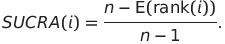

```{r message=FALSE, warning=TRUE}
library(ggplot2)
library(ggthemes)
library(knitr)
library(kableExtra)
library(darkpeak)
set.seed(23081921)
```

```
# MY NOTES:
  - i like ceac because wtp may not be fixed
  - direction of INB ~ wtp is important!
  - but so many issues with ranking data
  - rankograms are super confusing
  - DM probably misinterpret what they see?
  - if there is no clear winnier, use rankograms only to quantify uncertainty?
``` 

<br><br>

## Introduction

In August 2020, NICE published a report on their regular methodology update. In that report, they revisit the use of cost-effectiveness acceptability curves (CEACs) and rankograms, two different methods to visualise the outcomes of probabilistic sensitivity analyses in health economic modelling. In this paper, I briefly discuss both of the methods and draw attention to some of the peculiar limitations that inevitably arise when working with rankings, irrespective of the way in which they are illustrated.

<br><br>

## What is a CEAC?

CEACs are used to visualise the results of probabilistic sensitivity analyses. They show the probability with which a given treatment is cost-effective, compared to all other treatments under consideration, for a range of thresholds. More specifically, they show the proportion of probabilistic results in which the treatment is optimal, i.e. in which it is *the most cost-effective* treatment.

<!-- NOTE: bootrpping/MC simulation now common, no anlytical thing anymore  -->

CEACs have been introduced by van Hout et al. in the 1990's, as a method to 'give an idea about the uncertainties surrounding the estimate of the CE-ratio'. Since then, their paper has received almost 1,000 citations, and CEACs have been become a mainstream part of the formal health technology appraisal process in England, as well as in many other countries.

Arguably, CEACs present information about uncertainty in a format that is more relevant to decision making, and decision makers may consider CEACs overall easier to interpret than incremental cost-effectiveness ratios with confidence intervals.

The visual simplicity of CEACs comes at a cost, though. Cardinal information about the distributions of incremental costs and benefits is reduced to a first-past-the-post ranking: it is only taken into account how often a given treatment wins against all other treatments, not by which margin, and not how any non-winning treatment fares.

With this paper, I try raise awareness for the complexities and the sometimes rather unintuitive behaviour of ranking data analysis, such as the CEAC and rankograms. I do not intend to formally investigate their axiomatic properties, but rather to provide some intuition for modellers, decision makers and other practitioners in the field.


|
|-------------------------|-------------------|
 *Figure X.* Sample CEAC and ICER show the results of a probabilistic sensitivity analysis (with 10,000 iterations) of the fictitious treatment, Supimab against Standard of Care.

<br><br>

## 1. Cardinal vs ordinal data - what's the difference?

To get started, consider the following simple example. Suppose an economic evaluation of two treatments A and B. Treatment A is known to be effective and it generates 0.1 QALYs per patient. Treatment B is new, and there considerable uncertainty whether it is effective at all: there is 70% chance that it has no effect, and a 30% chance that it generates 10 QALYs per patient. For simplicity, further suppose that both treatments are available at a cost of GBP 2,000.

Now, if we calculate the expected net benefit, say for a threshold of 20,000, we find that it is much higher for treatment B than for treatment A.

```{r}
# Treatment A
1 * 0.1 * 20000 - 1000

# Treatment B
(0.7 * (0 * 20000) + 0.3 * (10 * 20000)) - 1000 
```


Yet, on a CEAC, treatment A would undoubtedly seem to be the better choice for any given threshold: Treatment A always has a 70% probability of being cost-effective. The CEAC thereby conceals the fact that the margin by which treatment A wins each time is very small, and that the margin by which it loses in 30% of the cases (when treatment B is effective) is enormous.

This is not to say that treatment B is unequivocally the better decision - decision makers may have reasons not to maximise the expected net benefit but to implement a treatment that is proven to be effective. However, it important that decision makers can interpret CEACs correctly, and are aware that, contrary to intuition, the treatment that is most likely to be cost-effective is not necessarily the most cost-effective treatment.

```{r message=FALSE, warning=FALSE}
# qaly matrix
mat_Q = matrix(
  ncol = 2,
  nrow = 1000,
  data = c(
    rep(1 * 0.1, 1000),
    sample(c(rep(1, 3), rep(0, 7)), 1000, replace = T) * 10
  )
)

mat_C = matrix(
  ncol = 2,
  nrow = 1000,
  data = 1000
)
colnames(mat_Q) = colnames(mat_C) = c("A", "B")

p1 <- makeCEAC(
  total_qalys = mat_Q, total_costs = mat_C,treatment = colnames(mat_Q)
)
p1 + xlim(1,50000)
```


<br><br>

## 2a. More than two alternative: the Condorcet criterion

From this simple two-treatment example, let's turn to decisions in which four treatments are considered simultaneously: treatment O (the old established treatment), and three new treatments x1,x2, and x3.

Suppose that after building a complicated cost-effectiveness model, we find that the results of the probabilistic sensitivity analysis with 10,000 iterations shows the following results: for a given threshold, Treatment 0 wins in 40% of the cases, while treatments x1,x2, and x3 win in only about 20% respectively.

One might quickly jump to the conclusion that A is likely to be the optimal treatment. After all, treatment 0's probability of being the most cost-effective option is twice as high as for any of the other three treatments.

However, in a pairwise comparison between treatment 0 and treatment x1, we would find that x1 wins against A 60% of the time. The same holds true for pairwise comparisons between treatment 0 and x2; and between treatment 0 and x3.

But how can treatment 0 appear to be the winner on the aggregate, if it loses in any pairwise comparison? Treatment 0 is the most cost-effective treatment in 40% of the cases, but in 60% it is the least cost-effective. In these 60% of the cases, x1,x2 and x3 are more cost-effective, but the first, second, and third place is equally distributed among them. Therefore, each of the new treatments gets the first place of being *the most* cost-effective treatment less frequently (see table X below).


```{r results="asis"}
# generate rank data
pu = function(a,b,c,d,n = 100){
  cbind(
    "treatment_0" = rep(a, n),
    "x1" = rep(b, n),
    "x2" = rep(c, n),
    "x3" = rep(d, n)
  )
}
mat_c =  rbind(
  pu(1,2,3,4,133),
  pu(1,4,2,3,133),
  pu(1,3,4,2,134),
  
  pu(4,1,2,3,200),
  pu(4,3,1,2,200),
  pu(4,2,3,1,200)
)

# first rank probability
table(apply(mat_c,1,which.min))/1000


# all rank probabilities  
rankogram_c = apply(apply(mat_c,1,rank),1,function(x)c(sum(x==1),sum(x==2),sum(x==3),sum(x==4)))
rankogram_c = rankogram_c / 1000
# colnames(rankogram_c) <- c("treatment 0","x1","x2","x3")
# rankogram_c
knitr::kable(rankogram_c, format="html",caption = "Table X: rank") %>%
  kable_styling(full_width = F)
```

<br><br>


## 2b. More than two alternative: the Condorcet paradox

After we uncovered that, for a given threshold, treatment 0 loses against each of the three new treatments in a pairwise comparison, we may want to drop A from the aggregate analysis and focus on the three new treatments instead. On the aggregate, the probability of being the most cost-effective treatment is the same for x1, x2, and x3. Notwithstanding, in a head-to-head comparison, we can uncover another peculiar feature of rankings: If we compare treatment x1 to treatment x2, we finds that x2 wins in 66.7% of the cases; if we compare x2 to x3, and find that x3 wins against x2 in 66.67% of the cases - does this mean x3 is the optimal decision? No, x1 beats x3 in 66.7% of the cases, at which point we went full circle, and derive an intransitive preference order. This is not a computational mistake or a fault of the CEAC, but an instance of the, so called, Condorcet paradox. A situation in which first-past-the-post rankings yield cyclic preferences.

```{r}
# x1 vs x2
mean(mat_c[,"x1"] < mat_c[,"x2"])
# x2 vs x3
mean(mat_c[,"x2"] < mat_c[,"x3"])
# x3 vs x1
mean(mat_c[,"x3"] < mat_c[,"x1"])
```

<br><br>

## 3. A violation of independence 

Another issue with ranking data is the violation of the independence of irrelevant alternatives axiom. Translated into an health economic contexts, it states that whether treatment A is preferred over treatment B should depend on the preferences over treatment A and treatment B, and not on preferences on some treatment C. This may sound rather intuitive, but the axiom can easily be violated on a CEAC.

Suppose there are three treatments: A, B, and C, with probabilities of being most cost-effective of 45%, 33%, and 22% respectively. At first glance, it seems that treatment A clearly wins against treatment B. However, this depends on treatment C being taken into account. If B is removed from the model, treatment B suddenly has a 55% probability of being most cost-effective.

This is explained by the following constellation. In 45% of the probabilistic sensitivity analysis iterations, A > C > B; in 33% B > C > A; and in 22% C > B > A. This means, whenever C is most cost-effective, B beats A, but this information is dismissed, because only the first ranked treatment is taken into account in a CEAC.

```{r}
# utility functions
pu2 = function(a,b,c,d=NULL,n = 100){
  cbind(
    a = rnorm(n = n,mean = a,sd=0),
    b = rnorm(n = n,mean = b,sd=0),
    c = rnorm(n = n,mean = c,sd=0),
    if (!is.null(d)) d = rnorm(n = n, mean = d, sd = 0)
    )
}

mat_a =  rbind(
  pu2(1,3,2,n = 450),
  pu2(3,1,2,n = 330),
  pu2(3,2,1,n = 220)
)

# first rank probabilities with all treatments
table(apply(mat_a,1,which.min))/1000
# first rank probabilities when loser is removed
table(apply(mat_a[,-3],1,which.min))/1000
```

*****

<br><br>

## RANKOGRAMS


```{r}
# function to create various rankograms
source("rankogramGallery.R")
```

<br><br>

### 'easy rankogram'

```{r}
# easy rankogram
# Gen data from NICE
n <- 1000
A <- runif(n,800, 3000)
B <- runif(n,-250,1500)
C <- runif(n,800,4000)
D <- runif(n,500,2500)

r1_mat <- cbind(A,B,C,D)

# mean INB and 95%CI
apply(r1_mat,2,function(x){
  m <- mean(x)
  ci95 <- quantile(x,c(0.025,0.975))
  res <- formatC(c(m,ci95),format = "f",digits = 0, big.mark = ",")
  paste0(res[1]," (",res[2],"; ",res[3],")")
})


r1_rank_mat <- matrix(apply(-r1_mat,1,rank),ncol = ncol(r1_mat),byrow = T)
head(r1_rank_mat)
r1_rank_tbl <- matrix(apply(r1_rank_mat,2,table),ncol = ncol(r1_mat),byrow = F)
r1_rank_tbl <- r1_rank_tbl/n

colnames(r1_rank_tbl) <- LETTERS[1:4]
rownames(r1_rank_tbl) <- 1:4
r1_rank_tbl

m1_df <- reshape2::melt(r1_rank_tbl)
names(m1_df) <- c("rank","treatment","prob")

rankogram1(m1_df)
rankogram2(m1_df)
rankogram3(m1_df)
rankogram4(m1_df)
rankogram5(m1_df)


```


<br><br>

### 'difficult rankogram'

```{r}
# difficult rankogram
# Gen data from NICE
n <- 1000
A2 <- runif(n,800, 3000)
B2 <- runif(n,-250,1500)
C2 <- runif(n,-1000,5000)
D2 <- runif(n,500,2500)

r2_mat <- cbind(A2,B2,C2,D2)

# mean INB and 95%CI
apply(r2_mat,2,function(x){
  m <- mean(x)
  ci95 <- quantile(x,c(0.025,0.975))
  res <- formatC(c(m,ci95),format = "f",digits = 0, big.mark = ",")
  paste0(res[1]," (",res[2],"; ",res[3],")")
})


r2_rank_mat <- matrix(apply(-r2_mat,1,rank),ncol = ncol(r2_mat),byrow = T)
head(r2_rank_mat)
r2_rank_tbl <- apply(r2_rank_mat,2,table)
r2_rank_tbl <- r2_rank_tbl/n

colnames(r2_rank_tbl) <- LETTERS[1:4]
rownames(r2_rank_tbl) <- 1:4
r2_rank_tbl

m2_df <- reshape2::melt(r2_rank_tbl)
names(m2_df) <- c("rank","treatment","prob")


rankogram1(m2_df)
rankogram2(m2_df)
rankogram3(m2_df)
rankogram4(m2_df)
rankogram5(m2_df)


```
<br><br>

### rankogram aggregation

#### SUCRA: surface under the cumulative ranking score

> SUCRA = Borda count voting rule?!




```{r}
# easy ranking example
r1_rank_tbl
a = nrow(r1_rank_tbl)
j = ncol(r1_rank_tbl)
sucra = numeric()
for (x in 1:a) {
  sucra[x] = sum(cumsum(r1_rank_tbl[1:(j - 1), x]))/(j - 1)
}
names(sucra) <- colnames(r1_rank_tbl)
sucra

# difficult ranking example
r2_rank_tbl
a = nrow(r2_rank_tbl)
j = ncol(r2_rank_tbl)
sucra2 = numeric()
for (x in 1:a) {
  sucra2[x] = sum(cumsum(r2_rank_tbl[1:(j - 1), x]))/(j - 1)
}
names(sucra2) <- colnames(r2_rank_tbl)
sucra2

```

#### Borda count voting

```{r}
# easy ranking example
r1_rank_tbl
borda <- apply(r1_rank_tbl,2,function(x){
  sum(x*(nrow(r1_rank_tbl)-1):0)
})
names(borda) <- colnames(r1_rank_tbl)
borda

# difficult ranking example
r2_rank_tbl
borda2 <- apply(r2_rank_tbl,2,function(x){
  sum(x*(nrow(r2_rank_tbl)-1):0)
})
names(borda2) <- colnames(r2_rank_tbl)
borda2

```


*****

<br><br>

## 4. All pairwise ceacs


A case for 'all pairwise ceacs' ?


```{r}
# re-create NICE's easy and difficult rankograms with Q and C data ???
```


<!--
library(rmarkdown)
rmarkdown::render(input = "./arrow_nb.Rmd",output_format = html_document(),output_file = "index.html")
-->
